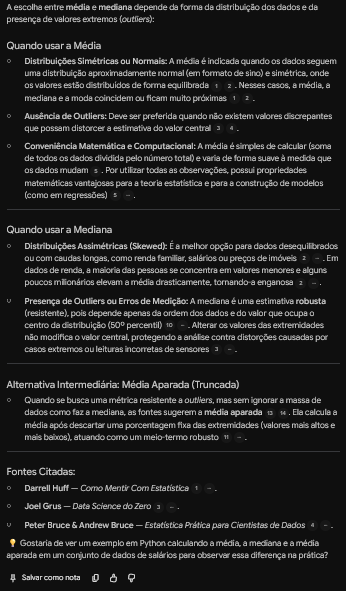
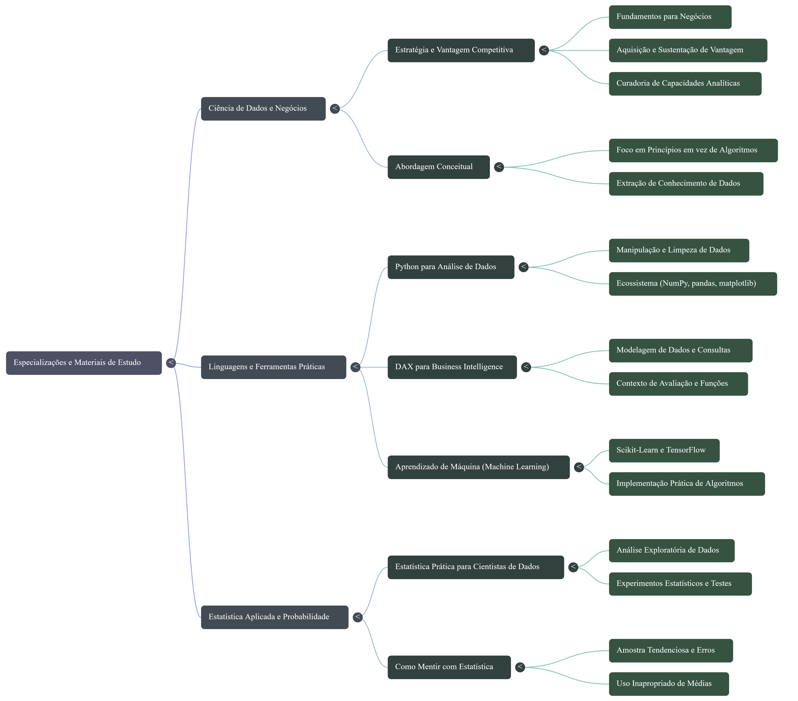

# Segundo Cérebro em Dados

Projeto do desafio da DIO: um notebook no NotebookLM (hoje Gemini Notebook) que atua como especialista em análise de dados e machine learning e responde **somente com base nas fontes que selecionei**, mostrando de onde tirou cada resposta.

## Tema e objetivo

Montar um especialista em análise de dados (Python, estatística aplicada, DAX/Power BI e machine learning) para me ajudar a estudar essas áreas, tirando dúvidas e gerando materiais de revisão a partir de livros de referência.

## Fontes

| Fonte | Autor(es) | Por que confio |
|-------|-----------|----------------|
| *Como Mentir com Estatística* | Darrell Huff | Clássico sobre como gráficos e médias enganam, bom para treinar o olhar crítico. |
| *Data Science do Zero* | Joel Grus | Constrói estatística e algoritmos do zero em Python, ótimo para entender o que há por trás das bibliotecas. |
| *Data Science for Business* (introdução) | Foster Provost e Tom Fawcett | Livro adotado em centenas de cursos, focado em pensar o problema de negócio. |
| *Estatística Prática para Cientistas de Dados* | Peter Bruce, Andrew Bruce e Peter Gedeck | Estatística aplicada, com foco em quando usar cada técnica. |
| *Mãos à Obra: Aprendizado de Máquina* | Aurélien Géron | Referência de ML aplicado com Scikit-Learn, Keras e TensorFlow. |
| *Python para Análise de Dados* | Wes McKinney | Escrito pelo criador do pandas, referência em manipulação e limpeza de dados. |
| *The Definitive Guide to DAX* | Marco Russo e Alberto Ferrari | Referência em DAX, com contexto de avaliação e modelagem. |

## Diretriz dada ao notebook

```text
Comporte-se como um especialista em análise de dados e machine learning. Responda sempre em português, de forma didática e com exemplos curtos. Use apenas as fontes do notebook e diga claramente quando elas não cobrirem a pergunta.
```

## Perguntas e respostas

### 1. Quando usar média e quando usar mediana?

**Resposta do notebook:**

A escolha entre **média** e **mediana** depende da forma da distribuição dos dados e da presença de valores extremos (*outliers*):

### **Quando usar a Média**

* **Distribuições Simétricas ou Normais:** A média é indicada quando os dados seguem uma distribuição aproximadamente normal (em formato de sino) e simétrica, onde os valores estão distribuídos de forma equilibrada[1][2]. Nesses casos, a média, a mediana e a moda coincidem ou ficam muito próximas[1][2].
* **Ausência de Outliers:** Deve ser preferida quando não existem valores discrepantes que possam distorcer a estimativa do valor central[3][4].
* **Conveniência Matemática e Computacional:** A média é simples de calcular (soma de todos os dados dividida pelo número total) e varia de forma suave à medida que os dados mudam[5]. Por utilizar todas as observações, possui propriedades matemáticas vantajosas para a teoria estatística e para a construção de modelos (como em regressões)[5].

---

### **Quando usar a Mediana**

* **Distribuições Assimétricas (Skewed):** É a melhor opção para dados desequilibrados ou com caudas longas, como renda familiar, salários ou preços de imóveis[2]. Em dados de renda, a maioria das pessoas se concentra em valores menores e alguns poucos milionários elevam a média drasticamente, tornando-a enganosa[2].
* **Presença de Outliers ou Erros de Medição:** A mediana é uma estimativa **robusta** (resistente), pois depende apenas da ordem dos dados e do valor que ocupa o centro da distribuição (50º percentil)[10]. Alterar os valores das extremidades não modifica o valor central, protegendo a análise contra distorções causadas por casos extremos ou leituras incorretas de sensores[3].

---

### **Alternativa Intermediária: Média Aparada (Truncada)**

* Quando se busca uma métrica resistente a *outliers*, mas sem ignorar a massa de dados como faz a mediana, as fontes sugerem a **média aparada**[13][14]. Ela calcula a média após descartar uma porcentagem fixa das extremidades (valores mais altos e mais baixos), atuando como um meio-termo robusto[11]

**Fonte(s) citada(s):** * **Darrell Huff** — *Como Mentir Com Estatística*[1].
* **Joel Grus** — *Data Science do Zero*[3].
* **Peter Bruce &amp; Andrew Bruce** — *Estatística Prática para Cientistas de Dados*

### Print do chat com as citações



## Materiais gerados

Mapa mental criado no Estúdio, organizando as fontes em três eixos: **Ciência de Dados e Negócios**, **Linguagens e Ferramentas Práticas** (Python, DAX e Machine Learning) e **Estatística Aplicada e Probabilidade**.



## Link do notebook

https://notebook.google.com/notebook/753609bd-13fc-4055-a8fc-52e2db18d46c

## O que aprendi

- Poucas fontes bem escolhidas funcionam melhor do que muitas sem critério.
- Clicar nas citações ajuda a conferir se a resposta realmente vem do texto.
- Gerar mapas mentais ajuda a visualizar como os assuntos se conectam.
